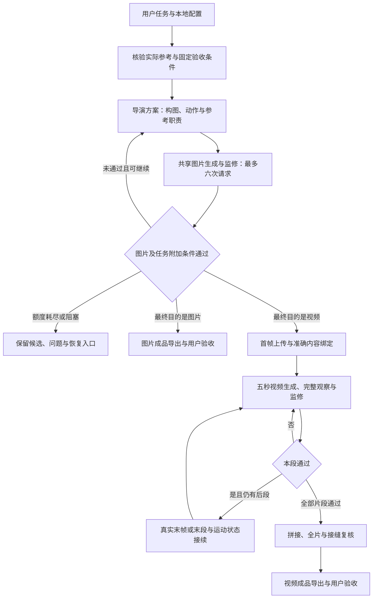

# AniGen

AniGen 将图片制作与视频制作放在同一个可追溯的工作区。图片任务完成资料核验、导演构图、生成、监修与修订；视频任务复用同一图片阶段制作首帧，再进入分段视频生成、监修、接续和全片验收。

**Codex 负责理解任务、核验实际资料、担任导演并判断画面；Python 工具负责单次调用、预算、输入冻结、文件关联、恢复和交付。** 本项目不是无人值守的后台 Agent。表单齐全、文件校验通过或生成接口返回成功，都不能代替对实际图片和完整视频的审查。

## 整体框架



| 模块                          | 职责                                                                       |
| ----------------------------- | -------------------------------------------------------------------------- |
| `src/anigen/workspace.py`   | 按最终目的建立任务、冻结命名和身份、生成任务索引                           |
| `src/anigen/config.py`      | 指定工作区及字段读取、配置别名冲突检查；导入时不读取配置                   |
| `src/anigen/image/`         | 共用 Gemini/GPT 图片后端、六次请求账本、冻结输入、恢复、逐图审核和包内模板 |
| `src/anigen/bridge.py`      | 视频首帧与共享图片账本的交接；同一次图片请求只计一次                       |
| `src/anigen/video/`         | 导演时间线校验、首帧附加门禁、视频调用、媒体处理、视觉观察、接续与终审     |
| `src/anigen/delivery.py`    | 准确通过版本的导出、当前有效性检查、独立用户验收                           |
| `.agents/skills/`           | 图片工作流、场景导演、首帧监修和视频工作流的操作方法                       |
| `scripts/public_release.py` | 从明确审查过的逐文件清单构建公开源码副本                                   |

公共代码只接收通用的已核验证据，不包含任何私有资料服务客户端、工具清单或内部协议。实际接入、资料范围和专用配置由使用者在本地维护。

## 核心行为

- **图片最多六次总请求，包含首次、已发送失败及重试。** 明确未发送不占额；未知结果保守占额并阻止重发。恢复、重开或补记授权不能恢复同一任务额度。
- 同一图片阶段同时用于独立图片和视频首帧。局部缺陷可编辑，构图不成立可重新设计，也可选择已经登记的历史候选作为底图。不会自动切换后端；用户明确要求换后端时保留授权及实际工具记录，继续累计原额度。
- 六次是上限，不要求用满；最后一次有图也要完成审核。耗尽仍未通过时保留候选，不能自动选“最好的一张”交付或继续生成视频。
- 普通图片通过不等于首帧可用。首帧还要核查构图、接触关系、起始动作可行性、画幅和严格保持项，并绑定原始参考、实际图片、报告及真实上传回执。
- 视频每段五秒、每段最多五次，另受整体生成次数及秒数限制。通过前段后才继续；后段使用其实际末帧或末段，不能凭文字描述假定连续性。
- 视频观察有独立额度；保留完整视觉观察、抽帧、片段审核、全片及接缝复核。当前不审核音频，送审副本移除音轨，原始视频可保留原音轨。
- 首帧重开、参考或导演输入变化时，需要重新核验相关通过状态并使下游依赖失效。所有旧版本与历史意见保留。
- Agent 通过与用户验收分开。用户没有回复时保持待验收；被撤销审批的旧成品保留为历史，不能继续展示为当前有效交付。

## 任务保存规则

按**最终目的**分类，根目录使用单数 `generation/`：

```text
generation/
  figs/
    {time}*{simple_task_description}*gpt/
    {time}*{simple_task_description}*gemini/
  videos/
    {time}*{simple_task_description}*gpt-minimax/
    {time}*{simple_task_description}*gemini-minimax/
```

`time` 使用东京时区的 `YYYYMMDDTHHMMSSffffff+0900`；微秒配合排他创建避免覆盖。任务描述可用中文或英文，最多 48 个字符；保留两个字面 `*` 分隔符，字段内路径分隔符和保留符号会被清理。脚本通过路径 API 传递文件名，命令行中的任务路径必须引用，避免 `*` 被解释为通配符。

目录记录创建时的目的与工具链，恢复时保持不变。图片工具为 `gpt` 或 `gemini`；视频追加 `-minimax`。这只是目录标签，准确模型、调用是否发生及实际用量以每轮记录为准。用户明确更换后端时，目录仍保留初始标签，索引和新轮次记录变更，不重置预算。

```text
<图片任务>/
  task.json                       任务身份、命名和图片账本关联
  brief.md                        用户原始要求
  authorization.md
  references/
  image/                          图片状态、完整输入、所有轮次与监修
  feedback.md
  README.md                       本任务过程索引
  final_output/                   仅准确通过的版本化图片

<视频任务>/
  task.json
  brief.md
  authorization.md
  references/
  director/
  keyframe/                       首帧图片账本、全部尝试与监修
  video/<internal_run_id>/         视频状态、片段、观察、接续和拼接候选
  feedback.md
  README.md
  final_output/                   仅全片终审通过的版本化视频
```

视频首帧、失败候选和所有中间记录始终属于同一个视频任务；即使没有生成出视频，也不会改存到 `figs/`。首帧通过只代表可进入后续阶段，不会作为视频任务的最终成品导出。

输入、产物、修改理由、审核、耗时及服务返回的用量保存在任务内。未返回的费用写“未知”，不从目录标签或请求次数推算。所有真实任务、参考、运行记录和成品都保持本地，不进入公开源码。

## 运行与配置

需要 Python 3.12+、FFmpeg 和 ffprobe；Python 运行时仅使用标准库。文件锁依赖 `fcntl`，支持 macOS/Linux，当前不提供原生 Windows 支持。

无需安装 Python 包即可查看入口及运行离线测试：

```sh
python3 run.py --help
python3 run.py backends
python3 scripts/test_offline.py
```

也可将本项目安装为本地 Python 包，使用 `anigen` 命令。包内包含图片模板，运行不依赖原工作区的技能目录。

配置只从显式工作区的本地 `.env` 或进程环境读取。命令的 `--workspace` 默认当前目录；恢复已有任务时以该任务所属工作区为准。库调用可使用 `use_workspace(path)` 或 `ANIGEN_WORKSPACE`。

| 配置字段                                     | 用途                                                  |
| -------------------------------------------- | ----------------------------------------------------- |
| `IMAGE_BACKEND`                            | 未在任务中明确指定时的图片后端，`gpt` 或 `gemini` |
| `REFERENCE_SCOPE_ID`                       | 正式任务允许使用的参考范围；离线任务使用合成范围      |
| `GPT_API_KEY` / `OPENAI_API_KEY`         | GPT 图片凭据别名                                      |
| `GPT_IMAGE_MODEL` / `OPENAI_IMAGE_MODEL` | GPT 图片模型别名，须明确配置或在请求中指定            |
| `GEMINI_API_KEY` / `GOOGLE_API_KEY`      | Gemini 凭据别名                                       |
| `GEMINI_IMAGE_MODEL`                       | 独立图片模型设置，显式请求参数优先                    |
| `FAL_KEY`                                  | 视频生成及素材上传凭据                                |

同名配置以进程环境优先；两个别名提供不同值时拒绝选择并只提示字段名。原有字段可通过本地 `.private/config-aliases.json` 映射到通用字段，不必覆盖现有 `.env`。配置不会被当作 shell 执行，也不会在导入模块时加载或导出凭据。

模型能力与账户权限是不同问题。当前代码包含请求格式和本地参数校验，不能据此推断账户有模型访问权或保证真实生成质量。

## 使用入口

先由用户或 Codex 准备原始要求 Markdown。以下例子仅建立离线任务，不调用模型：

```sh
python3 run.py new image --description '双人插画' --backend gpt --brief-file brief.md
python3 run.py new video --description '双人短片' --backend gemini --brief-file brief.md
```

命令输出创建的任务路径。正式制作需显式指定 `--mode generation --authorization-file authorization.md`，其中记录当前任务的真实生成指令；记录文件本身不创造用户授权。

后续操作均绑定这个任务路径，不直接创建新的图片或视频运行根目录：

| 入口                                                                                        | 用途                                                                           |
| ------------------------------------------------------------------------------------------- | ------------------------------------------------------------------------------ |
| `image <action> --task <任务路径> ...`                                                    | 图片 prepare、check-request、generate、collect、review、derive、recover 等动作 |
| `video <action> --task <任务路径> --input <JSON> [--live]`                                | 视频计划初始化、首帧、素材、分段、观察、接续与全片动作                         |
| `status --task <任务路径>`                                                                | 刷新可读过程索引并核对当前交付有效性                                           |
| `deliver --task <任务路径> --round <轮次> --candidate <图片名>`                           | 导出准确通过的独立图片                                                         |
| `deliver --task <任务路径>`                                                               | 导出当前终审通过的完整视频                                                     |
| `accept --task <任务路径> --version <成品名> --status accepted --comment-file <Markdown>` | 记录用户对准确版本的接受；要求修改使用`changes_requested`                    |

例如图片输入准备、离线校验与审核登记：

```sh
TASK='generation/figs/20260101T120000000000+0900*示例*gpt'
python3 run.py image prepare --task "$TASK" --prompt-file prompt.md --reference-file reference.md --backend gpt --model gpt-image-1 --api-text-file submission.md --input reference reference.png
python3 run.py image check-request --task "$TASK" 001
python3 run.py image review --task "$TASK" 001 output-01.png --report-file review.md --verdict pass
```

上述路径与型号仅展示参数位置，需换成实际任务和已核验可用的配置；审核前必须已经保存并检查实际产物。图片发送要显式 `generate ... --execute --evidence-ready`；视频实时服务动作需已有相应授权及 `--live`，查询/恢复也受离线任务边界约束。离线任务不能因设置一个开关而变成真实制作任务。

视频首帧停止后，`keyframe-discard` 可带原因取消尚未保留额度、确认未发送的草稿；`keyframe-reauthorize` 可记录用户新的明确指令，在原范围和原累计上限内恢复授权。二者均不发送请求。已保留额度或结果未知的请求不能丢弃，应先通过 `keyframe-recover` 核对结果；续授权也不能增加图片或上传额度。

详细工作方法见 [制作合同](docs/workflows.md) 以及四个技能：[图片工作流](.agents/skills/image-workflow/SKILL.md)、[场景导演](.agents/skills/scene-director/SKILL.md)、[首帧监修](.agents/skills/keyframe-review/SKILL.md)、[视频工作流](.agents/skills/video-workflow/SKILL.md)。完整图片参数可通过 `PYTHONPATH=src python3 -m anigen.image --help` 查看；低层工具保留用于开发与离线测试，正常制作由统一任务入口组织。

## 验证范围

测试覆盖图片计数及恢复、共享首帧、视频分段与接续、素材完整性、交付审批、任务分类命名、配置边界和公开导出。测试使用合成媒体及假提供方；完整测试入口清除继承凭据并阻断网络连接。

迁移验证不包含真实付费图片、视频或观察调用，不证明语义监修准确率、人物保真或动态质量。实际制作仍须核验当前参考来源、账户权限，并逐轮检查实际产物。
